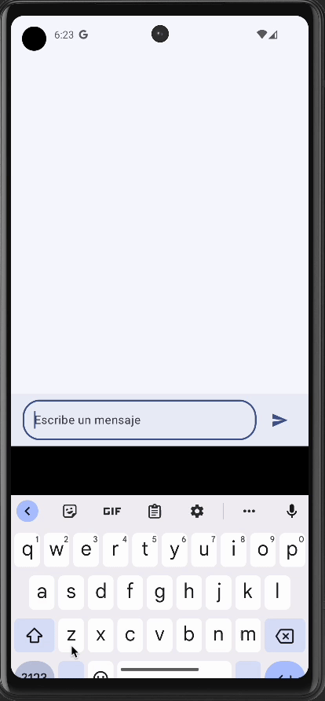

# AI Chat

An Android application for chatting with artificial intelligence that allows you to have conversations with an AI assistant and save conversation history.

## 🚀 Project Purpose

This project aims to explore a new work methodology that combines **Cursor** and **Android Studio** for Android application development. Through the creation of this AI chat application, we have experimented with a hybrid workflow that leverages the specific capabilities of Android Studio along with the AI assistance provided by Cursor, enabling greater productivity and efficiency in development.

## 📱 Demo



## 📱 Main Features

- Real-time chat with OpenAI
- Conversation history
- Automatic generation of conversation titles using AI
- Intuitive user interface based on Material 3
- Support for deleting conversations
- Design adapted for internationalization (i18n)

## 🏗️ Architecture

The application is built following a clean architecture with separation of layers:

```
com.teseostudios.aichat/
├── data/                  # Data layer
│   ├── local/             # Local persistence (Room)
│   │   ├── dao/           # Data Access Objects
│   │   └── entity/        # Database entities
│   ├── mapper/            # Mappers to convert between entities and models
│   ├── network/           # Communication with external APIs
│   └── repository/        # Repository implementations
├── di/                    # Dependency injection (Hilt)
├── domain/                # Domain layer
│   ├── model/             # Domain models
│   └── repository/        # Repository interfaces
└── ui/                    # Presentation layer
    ├── components/        # Reusable UI components
    ├── screens/           # Application screens
    │   └── chat/          # Chat screen and related components
    ├── theme/             # Application styles and themes
    └── viewmodel/         # ViewModels (MVVM)
```

### Design Patterns

- **MVVM** (Model-View-ViewModel) for separation between UI and business logic
- **Repository Pattern** to abstract data sources
- **Clean Architecture** for separation of layers and responsibilities
- **Dependency Injection** for dependency management

## 🛠️ Technologies Used

- **Kotlin** as the main programming language
- **Jetpack Compose** for declarative UI
- **Material 3** as the design system
- **Hilt** for dependency injection
- **Room** for local data persistence
- **Kotlin Coroutines & Flow** for asynchronous operations and reactive programming
- **ViewModel** from Architecture Components
- **OpenAI API** for AI functionality
- **Ktor** as HTTP client for communications with the OpenAI API

## 🧩 Notable Technical Features

### Persistence
- **Room database** to store conversations and messages
- **Entity relationships** (Conversation → Messages)
- **Reactive flows** to observe data changes

### AI Interaction
- Integration with OpenAI API to generate responses
- Use of conversation context to maintain coherence
- Generation of conversation titles using the same AI

### UI/UX
- Design with Material 3 for a modern appearance
- Smooth animations and transitions
- Side menu to navigate between conversations
- Loading indicators during API communications

## 🔄 Development Workflow

This application has been developed using a hybrid workflow that combines:

- **Android Studio** for initial design, project setup, and device testing
- **Cursor** as an IDE for code implementation, using its AI assistance to improve productivity

This dual approach allowed leveraging the strengths of both tools: Android Studio's specific Android capabilities and Cursor's intelligent assistance for code writing.

## 🚀 Project Setup

### Requirements
- Android Studio Iguana or higher
- JDK 11 or higher
- OpenAI API Key

### Configuration
1. Clone the repository
2. Create a `local.properties` file in the project root and add your API key:
   ```
   open.api.key="your_openai_api_key"
   ```
3. Sync the project with Gradle
4. Run the application on an emulator or device

## 📝 Additional Notes

- The application is prepared for internationalization, with all texts defined in string resources.
- KSP (Kotlin Symbol Processing) is used instead of KAPT to improve compilation times.
- The code is structured to facilitate future extensions such as adding new AI models or functionalities.

## 🙏 Acknowledgements

Thanks to **Antonio Leiva** and his DevExpert channel for teaching this work methodology that combines the capabilities of **Cursor** and **Android Studio**, which has significantly increased productivity in development. The integration of Cursor's AI assistance with Android Studio's specific tools has been key to quickly implementing complex functionalities, all learned through his excellent workshop:

- [Antonio Leiva's Android Workshop at DevExpert](https://www.youtube.com/watch?v=VGLXRna1i3U)
